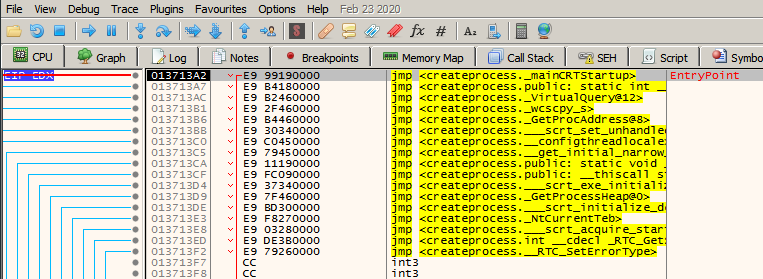
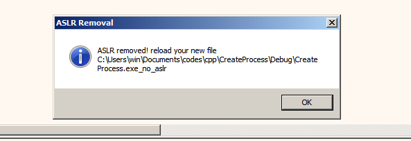
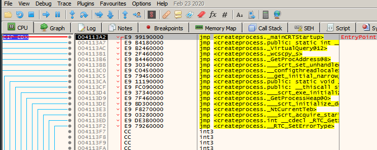

# x64dbg ASLR Removal

## ***Deprecated, the latest versions of x64dbg already support this by just checking the box in the `Options > Preferences > Engine` tab*** 

# What ?

This plugin remove ASLR from PE files that are being currently debugged in [x64dbg](https://x64dbg.com/) by copying and patching the new file.

# Why ?

ASLR - Address space layout randomization, it's a security feature that randomize all the virtual memory addresses of a process, that protect from memory corruption exploitation, ROP chains and other in memory threats, as the attacker needs to now the RVA + address to performer jump in memory, this make this process more difficult and sometimes not worth it to lose time.

## Install

* Download the plugin for x32/x64 in release page
* Copy to plugin folder inside x64dbg

## Usage:

* Open the file in x64dbg
* Execute the plugin, available in plugin tab
* Re-open patched file

### Screenshoots

### With ASLR:

### Plugin/Patch

### Without ASLR

The initial idea was to be able to do that before the process start and not modify the binary itself, but this unfortunately it's not possible from the x64dbg plugin development design. A future approach is to hook **CreateProcess** call from [ TitanEngine](https://github.com/x64dbg/TitanEngine)(x64dbg engine)
to disable ASLR before the debugger session start.
## Special thanks

* [@merces](https://github.com/merces) for the core idea of this plugin
* [x64dbg](https://github.com/x64dbg) dev team for clarify a lot of our doubts

Thanks.
